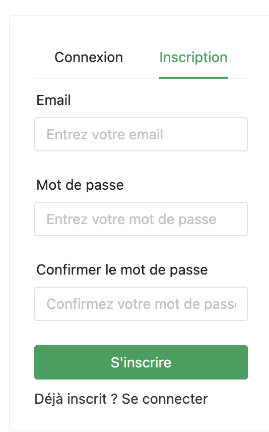
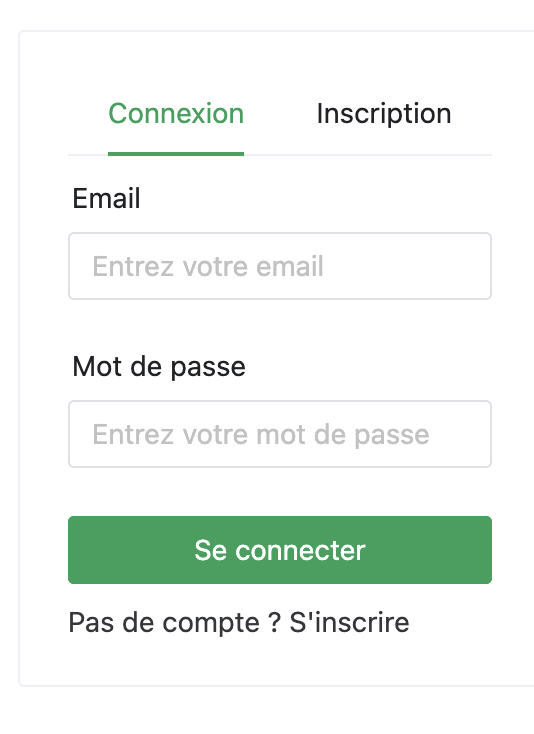

# Pokemon TCG SPA

Le but de ce projet est de créer une application web permettant de gérer des decks de cartes Pokémon.

## Grille de notation

| Critère                           | Points | Description                                                                                                                       |
|-----------------------------------|--------|-----------------------------------------------------------------------------------------------------------------------------------|
| Page Login                        | 3      | La page affiche un formulaire de connexion et d'inscription valide et fonctionnel                                                 |
| Page DeckBuilder                  | 6      | La page affiche la liste des cartes pokémons et permet de créer un nouveau deck                                                   |
| Page DeckCollection               | 4      | La page affiche la liste des decks de l'utilisateur connecté et permet d'intéragir avec ces derniers                              |
| Définition des types (typescript) | 1      | Utilisation de typescript pour la définition des types et aucune erreur lors de l'utilisation de la commande `npm run type-check` |
| Utilisation du DS                 | 2      | Vous faîtes appels à Naive-UI au maximum possible pour profiter du DesignSystem                                                   
| Mise en forme CSS                 | 2      | La mise en page CSS est travaillée. Vous pouvez suivre les maquettes ou faire la vôtre.                                           |
| Architecture du projet            | 2      | Découpage de l'application propre (stores, composants, pages,...)                                                                 |

> N'oubliez pas de renseigner votre nom et prénom dans le champ `author` du fichier `package.json`.
> La grille est notée sur 14 points. La section bonus vous propose différentes méthodes pour augmenter votre score. Voir
> la section [Bonus](#bonus).

## Introduction

#### Prérequis

- NodeJS version lts
- Navigateur web courant (Chrome, Firefox, Edge)
- Éditeur de code type VsCode

#### API

Nous allons nous baser sur l'API développé durant le cours de NodeJS. Dans le lien ci-dessous vous trouverez la
documentation de cette API.

[API Pokémon](https://pokemon-api-seyrinian-production.up.railway.app/api-docs/)

> Si vous souhaitez travailler avec votre propre API développez il n'y a aucun soucis. Dans ce cas vous devez la run en
> local sur votre port 3000. Et run en parallèle le projet VueJS sur un autre port. Appelez le professeur si vous avez
> des
> questions pour le faire.

#### Package.json

Le fichier `package.json` contient plusieurs `scripts` qui vous seront utiles:

- `npm run dev` : permet de lancer le serveur en mode développement
- `npm run build` : permet de compiler le projet en typescript.
- `npm run type-check` : permet de vérifier les types.
- `npm run start` : permet de lancer le serveur en mode production.

## Page Login

En premier lieu vous allez créer une page de login. Elle contiendra deux formulaires, un pour la connexion et un pour
l'inscription.

- Lors de la création du compte, l'utilisateur est redirigé vers le formulaire de connexion
- Lors de la connexion, l'utilisateur est redirigé vers la page DeckBuilder
- Lors de la connexion un token est stocké en local storage ainsi que l'id de l'utilisateur.

## Page DeckBuilder

### Liste des Pokémons

Pour commencer, vous allez construire une liste de carte pokémon. Vous pouvez suivre le modèle ci-dessous ou créer le
vôtre.

> Vous pouvez utiliser les composants NaiveUI suivants comme base : Ncard et NTag.

### Recherche

Vous allez intégrer un champ qui permet de rechercher un pokémon par son nom.

- La recherche filtre les cartes affichées
- Aidez-vous d'une `computed` pour filtrer les cartes.

### Création du deck

Maintenant, vous allez créer un deck de pokémon. Pour cela lorsque je cliquerai sur une carte de la collection elle
viendra s'ajouter à mon deck. Une fois satisfait, je donne un nom à mon deck et je le sauvegarde.

- Appel API pour sauvegarder un deck
- Réutilisation du composant PokemonCard pour la liste des cartes du decks
- Lors d'un clic sur une carte de la collection elle est ajoutée au deck
- Lors d'un clic sur une carte du deck elle est retirée du deck
- Créer une séparation visuelle claire entre les cartes de la collection et celles du deck

> Vous pouvez vous aider des composants NButton et NInput de NaiveUI pour réaliser cette partie.

## DeckCollection

### Liste des decks

Vous allez créer une page qui affiche la liste des decks de l'utilisateur.

- Appel API pour récupérer les decks puis on les filtrera ensuite pour n'afficher que ceux de l'utilisateur connecté.
  Aidez-vous d'une `computed` pour filtrer les decks.
- On ajoutera un bouton pour supprimer un deck
- On ajoutera un bouton pour voir le contenu du deck dans une modale.

> Vous pouvez vous aider des composants NDataTable ou NTable, NModal et NButton de NaiveUI pour réaliser cette partie.

np

